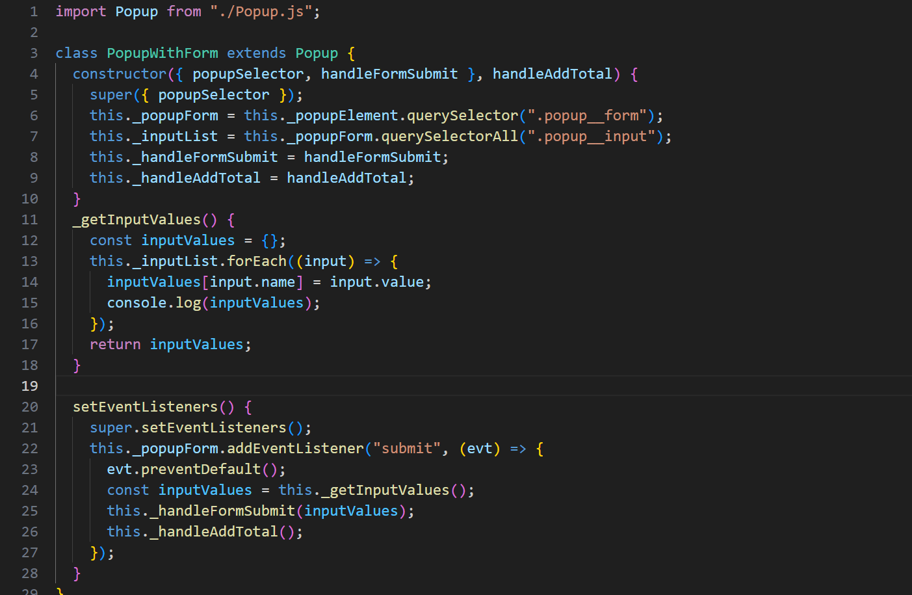

# Simple Todo App

This is an app that allows you to make a Todo list. For each Todo there is a todo and a date (optional). There is validity for the form to add tasks and uses Object Oriented Programming (OOP).

## Functionality

The main functionality of this project is the use of OOP. This project's purpose was mainly refactoring to use OOP. Specifically this uses loosely coupled classes which gives the code more flexibility.

## Technology

-OOP:
-JS Class Use

-private variables/functions

-Loosely Coupled Classes

## Deployment

This project is deployed on GitHub Pages:

- (https://samwaxman7.github.io/se_project_todo-app/)
