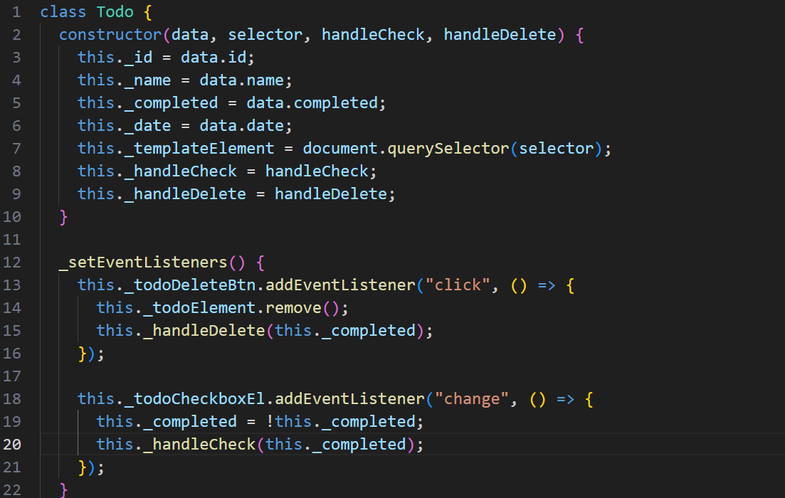

# Simple Todo App

This is an app that allows you to make a Todo list. For each Todo there is a todo and a date (optional). There is validity for the form to add tasks and uses Object Oriented Programming (OOP).

## Functionality

The main functionality of this project is the use of OOP. This project's purpose was refactoring code to OOP. This was done in the Todo Class and the FormValidator Class in their own Javascript files. Which were then imported into index.js.

## Technology

-OOP:
-JS Class Use

-private variables/functions

## Deployment

This project is deployed on GitHub Pages:

- (https://samwaxman7.github.io/se_project_todo-app/)
